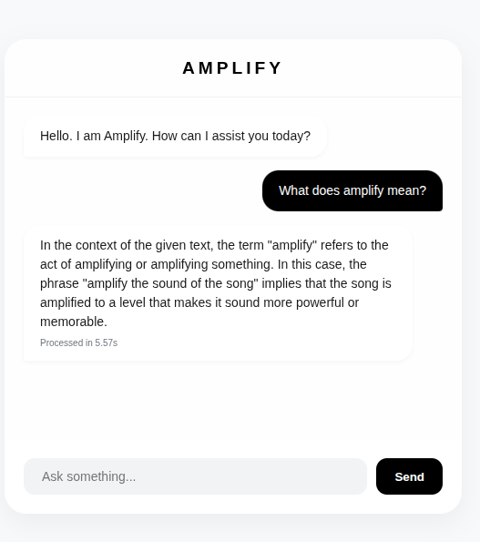

# AMPLIFY CHAT

AMPLIFY CHAT is a modern, minimalist AI chatbot interface powered by the **Nandi-Mini-150M-Instruct** model. It provides a sleek, browser-based chat experience with a focus on speed, aesthetics, and user feedback.



---

## ✨ Features

-   **Modern UI/UX:** A "Glassmorphism" inspired design using a clean monochrome palette.
-   **Live Latency Tracking:** Shows the exact time taken (in seconds) to process and generate each response.
-   **Visual Feedback:** Features a "processing" animation (typing indicator) so users know when the AI is thinking.
-   **Lightweight Model:** Uses the `Nandi-Mini-150M` model, optimized for quick instruction following.
-   **Fully Responsive:** Designed to look great on both desktop and mobile browsers.
-   **Remote Ready:** Pre-configured to work with `ngrok` for instant deployment to the web.

---

## 🛠️ Technology Stack

-   **Backend:** Python, Flask
-   **Frontend:** HTML5, CSS3 (Flexbox), JavaScript (Fetch API)
-   **AI Engine:** Hugging Face Transformers, PyTorch
-   **Model:** `Rta-AILabs/Nandi-Mini-150M-Instruct`

---

## 🚀 Installation

### 1. Clone the Repository
```bash
git clone [https://github.com/arafmustavi/Amplify-Chat.git](https://github.com/arafmustavi/Amplify-Chat.git)
cd Amplify-Chat
```

### 2. Install Dependencies
Ensure you have Python 3.8+ installed. It is recommended to use a virtual environment.
```bash
pip install torch torchvision torchaudio --index-url [https://download.pytorch.org/whl/cu118](https://download.pytorch.org/whl/cu118)  # For CUDA support
pip install flask transformers accelerate bitsandbytes
```

### 3. Project Structure
Ensure your files are organized as follows:
```text
/amplify-ai
│── app.py             # Flask Backend
└── /templates
    └── index.html     # Frontend UI
```

---

## 💻 How to Run

### Local Execution
Run the Flask server:
```bash
python app.py
```
Once the model finishes loading (indicated in the terminal), open your browser and go to:
`http://127.0.0.1:5000`

### Exposing to the Internet (ngrok)
To share your chatbot with others, use **ngrok**:
1. Keep the Flask app running in your first terminal.
2. Open a second terminal and run:
   ```bash
   ngrok http 5000
   ```
3. Copy the `Forwarding` URL provided by ngrok and share it!

---

## ⚙️ Model Configuration
The application automatically detects if a GPU (CUDA) is available. If no GPU is found, it will default to CPU mode.
- **Precision:** Uses `bfloat16` for efficient memory usage.
- **Inference Params:** - `Temperature: 0.3`
  - `Top_p: 0.9`
  - `Max New Tokens: 500`

---

## 📝 License
This project is open-source. Please check the `Nandi-Mini` model card on Hugging Face for specific model licensing details.

---
*Built with ❤️ for a better AI experience.*
